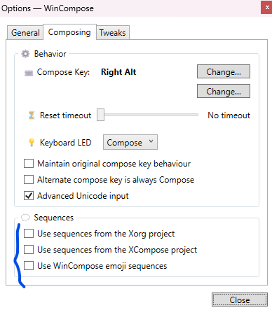

# Configuraciones necesarias al reinstalar windows

## Configuración de teclado
Usar Layout QWERTY US

Para configuracion de caracteres especiales, usar windows compose 
https://github.com/samhocevar/wincompose

Usar la siguiente configuracion de teclas:

<Multi_key> <n> : "ñ"
<Multi_key> <N> : "Ñ"
<Multi_key> <a> : "á"
<Multi_key> <A> : "Á"
<Multi_key> <e> : "é"
<Multi_key> <E> : "É"
<Multi_key> <i> : "í"
<Multi_key> <I> : "Í"
<Multi_key> <o> : "ó"
<Multi_key> <O> : "Ó"
<Multi_key> <u> : "ú"
<Multi_key> <U> : "Ú"
<Multi_key> <?> : "¿"
<Multi_key> <!> : "¡"

## Configuracion
Desactivar seccion de sequences que viene marcado por defecto.
